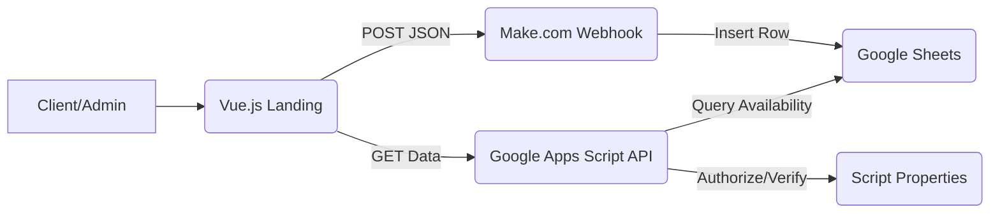

# 💈 BarberCol - Premium Landing & Booking System

[](https://vuejs.org/)
[](https://tailwindcss.com/)
[](https://opensource.org/licenses/MIT)

**BarberCol** is a high-end landing page and automated booking system for professional barbers. Built with a focus on **Visual Excellence**, **Security**, and **Efficiency**, it connects a modern Vue.js frontend with a flexible Google Sheets backend.

---

### 🌐 Live Demo
Visit the live site: [https://personalbarber.netlify.app/](https://personalbarber.netlify.app/)

---

## 🌟 Key Features

### 🛡️ Enhanced Security
- **Secure PIN Authorization**: Admin panel access and data retrieval are protected via backend-side verification.
- **Environment Safety**: Sensitive keys and PINs are managed through `.env` files (ignored by Git) and Google Script Properties.
- **Data Privacy**: Public availability views only show date and time status, keeping customer information private.

### 📅 Smart Reservations
- **Real-time Availability**: Direct synchronization with Google Sheets.
- **Past-time Blocking**: Automatically disables time slots that have already passed for the current day.
- **Automated Webhooks**: Integration with **Make.com** for instant notifications and CRM updates.

### 💎 Premium UX/UI
- **Dark Mode Aesthetic**: Sleek, modern interface using Tailwind CSS.
- **Responsive Layout**: Designed for seamless booking on both mobile and desktop.
- **Session Persistence**: Stay logged in to the admin panel while the tab is open.

---

## 🏗️ Project Architecture



---

## ⚙️ Setup & Installation

### 1. Frontend Setup
```bash
# Clone the repository
git clone https://github.com/JohnmaDev/P-Rose.git

# Navigate to the project
cd P-Rose/front

# Configure Environment Variables
# Copy the example file and fill in your keys
cp .env.example .env.local

# Install dependencies
npm install

# Run the development server
npm run serve
```

### 2. Backend Setup (Google Apps Script)
1. Create a Google Sheet to store appointments.
2. In the Sheet, go to **Extensions > Apps Script**.
3. Copy the content of `api_slots.gs` into the script editor.
4. Set your `ADMIN_PIN` in **Project Settings > Script Properties**.
5. **Deploy** as a Web App (Access: Anyone).
6. Copy the Deployment URL to your `.env.local`.

---

## 📦 Deployment
This project is configured for easy deployment on platforms like **Netlify** or **Vercel**. Simply connect your GitHub repository and set the environment variables in the platform's dashboard.

## 🤝 Contributions
Contributions are welcome! If you have ideas for new features or improvements, feel free to fork the repository and open a Pull Request.

## 📄 License
This project is licensed under the **MIT License**. Free for personal and commercial use.

---
Built with ❤️ by [JohnmaDev](https://github.com/JohnmaDev)
